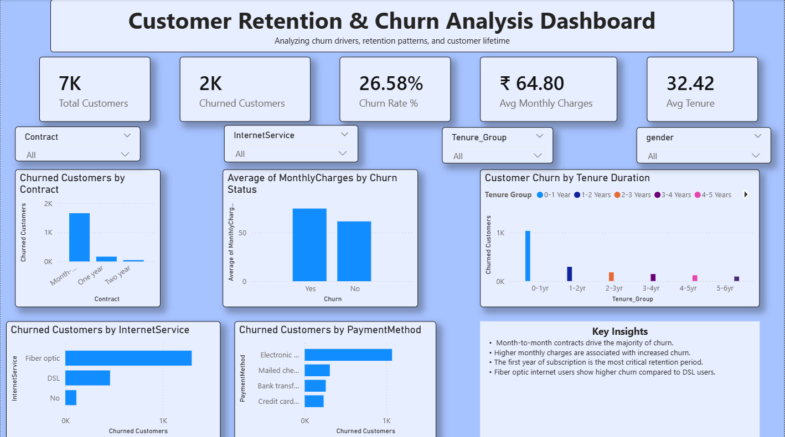

# Customer Retention \& Churn Analysis Dashboard

### ***Project Overview***

Customer churn is one of the most critical challenges for subscription-based businesses. Losing customers directly impacts revenue and long-term growth.

This project analyzes customer churn behavior in a telecom subscription business to identify:

* Key drivers of churn
* Customer retention patterns
* Opportunities to improve customer lifetime value

The final output is an interactive Power BI dashboard that provides clear business insights into why customers leave and how companies can reduce churn.

### ***Objectives***

The main goals of this project are:

* Analyze customer churn behavior
* Identify patterns in customer retention
* Understand how pricing, services, and contract types influence churn
* Build an interactive dashboard for business decision-making

### ***Dataset***

**Dataset**: Telco Customer Churn Dataset

**Total Customers**: 7,043

The dataset contains customer information including:

* Customer ID
* Contract type
* Monthly charges
* Customer tenure
* Internet service type
* Payment method
* Customer demographics
* Churn status (Yes / No)

This dataset simulates a telecommunications subscription business environment.

### ***Tools \& Technologies Used***

#### Python

Used for data cleaning and preprocessing

Libraries used:

* Pandas
* NumPy

Tasks performed:

* Handling missing values
* Converting data types
* Creating new features
* Preparing the dataset for visualization

### ***Power BI***

Used for data visualization and dashboard development

Features used:

* KPI cards
* Bar charts
* Interactive filters (slicers)
* Data modeling
* Business storytelling

#### GitHub

Used for version control and project documentation

Key KPIs

The dashboard highlights the following metrics:

|KPI|Value|
|-|-|
|Total Customers|7K|
|Churned Customers|2K|
|Churn Rate|26.58%|
|Average Monthly Charges|₹64.80|
|Average Customer Tenure|32.42 months|

&nbsp;	

These metrics give a quick overview of customer retention performance.

### ***Dashboard Features***

The Power BI dashboard includes several visualizations to analyze churn drivers.

#### Churn by Contract Type

Shows how different contract durations impact customer churn.

#### Average Monthly Charges by Churn Status

Analyzes whether customers paying higher monthly charges are more likely to churn.

#### Churn by Internet Service

Identifies which internet services experience higher churn rates.

#### Churn by Payment Method

Analyzes how payment methods correlate with churn behavior.

#### Churn by Customer Tenure

Shows when customers are most likely to leave the service.

#### Interactive Filters

Users can filter the dashboard by:

* Contract Type
* Internet Service
* Tenure Group
* Gender

### ***Key Insights***

From the analysis, several patterns emerge:

* Month-to-month contracts drive the highest churn rates.
* Customers with higher monthly charges are more likely to churn.
* The first year of subscription is the most critical retention period.
* Fiber optic internet users show higher churn compared to DSL users.

These insights help businesses understand customer behavior and churn risks.

### ***Business Recommendations***

Based on the analysis, businesses can reduce churn by:

1. Encouraging customers to switch from month-to-month to long-term contracts
2. Offering retention incentives during the first year of subscription
3. Investigating service quality for fiber optic internet users
4. Creating loyalty programs for long-term customers

### ***Dashboard Preview***

### ***Skills Demonstrated***

This project demonstrates several important data analytics skills:

* Data Cleaning \& Preprocessing
* Customer Churn Analysis
* KPI Development
* Data Visualization
* Business Insight Generation
* Dashboard Design
* Data Storytelling

#### ***Conclusion***

Customer churn analysis is essential for subscription-based businesses to maintain revenue and growth.

This project demonstrates how data analysis and visualization can uncover valuable insights that help organizations improve customer retention strategies and decision-making.

